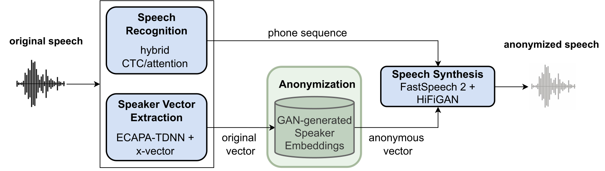

# Speaker Anonymization

This repository contains the speaker anonymization system developed at the Institute for Natural Language Processing 
(IMS) at the University of Stuttgart, Germany. The system is described in our paper [*Speaker Anonymization with 
Phonetic Intermediate Representations*](https://arxiv.org/abs/2207.04834) that will be 
published at 
Interspeech 2022. 

**In addition to the code, we are going to provide a live demo soon.**

## System Description
The system is based on the Voice Privacy Challenge 2020 which is included as submodule. It uses the basic idea of 
speaker embedding anonymization with neural synthesis, and uses the data and evaluation framework of the challenge. 
For a detailed description of the system, please read our paper linked above.




## Installation
### 1. Clone repository
Clone this repository with all its submodules:
```
git clone --recurse-submodules https://github.com/DigitalPhonetics/speaker-anonymization.git
``` 

### 2. Download models
Download the models [from the release page (v1.0)](https://github.com/DigitalPhonetics/speaker-anonymization/releases/tag/v1.0), unzip the folders and place them into a *models* folder as stated in the release notes. Make sure to not unzip the single ASR models, only the outer folder.
```
cd speaker-anonymization
mkdir models
cd models
for file in anonymization asr tts; do
    wget https://github.com/DigitalPhonetics/speaker-anonymization/releases/download/v1.0/${file}.zip
    unzip ${file}.zip
    rm ${file}.zip
done
```

### 3. Install challenge framework
In order to be able to use the framework of the Voice Privacy Challenge 2020 for evaluation, you need to install it 
first. According to [the challenge repository](https://github.com/Voice-Privacy-Challenge/Voice-Privacy-Challenge-2020), this should simply be
```
cd Voice-Privacy-Challenge-2020
./install.sh
```
However, on our systems, we had to make certain adjustments and also decided to use a more light-weight environment 
that minimizes unnecessary components. If you are interested, you can see our steps in 
[alternative_challenge_framework_installation.md](alternative_challenge_framework_installation.md). Just as a note: It is 
very possible that those would not directly work on your system and would need to be modified.

**Note: this step will download and install Kaldi, and might lead to complications. Additionally, make sure that you 
are running the install script on a device with access to GPUs and CUDA.**

### 4. Install requirements
Additionally, install the [requirements](requirements.txt) (in the base directory of this repository):
```
pip install -r requirements.txt
```

## Getting started
Before the actual execution of our pipeline system, you first need to download and prepare the challenge data and 
the evaluation models. For 
this, you will need a password provided by the organizers of the Voice Privacy Challenge. Please contact them (see 
information on [their repository](https://github.com/Voice-Privacy-Challenge/Voice-Privacy-Challenge-2020) or 
[website](https://www.voiceprivacychallenge.org/)) for 
this access.

You can do this by either

### a) Executing our lightweight scripts: 
This will only download and prepare the necessary models and datasets. Note that these scripts are simply extracts 
of the challenge run script.
```
cd setup_scripts
./run_download_data.sh
./run_prepare_data.sh
```

or by
### b) Executing the challenge run script:
This will download and prepare everything necessary AND run the baseline system of the Voice Privacy Challenge 2020. 
Note that you will need to have installed the whole framework by the challenge install script before.
```
cd Voice-Privacy-Challenge-2020/baseline
./run.sh
```

### Running the pipeline
The system pipeline controlled in [run_inference.py](run_inference.py). You can run it via
```
python run_inference.py --gpu <gpu_id>
```
with <gpu_id> being the ID of the GPU the code should be executed on. If this option is not specified, it will run 
on CPU (not recommended).

The script will anonymize the development and test data of LibriSpeech and VCTK in three steps:
1. ASR: Recognition of the linguistic content, output in form of text or phone sequences
2. Anonymization: Modification of speaker embeddings, output as torch vectors
3. TTS: Synthesis based on recognized transcription and anonymized speaker embedding, output as audio files (wav)

Each module produces intermediate results that are saved to disk. A module is only executed if previous intermediate 
results for dependent pipeline combination do not exist or if recomputation is forced. Otherwise, the previous 
results are loaded. Example: The ASR module is 
only executed if there are no transcriptions produced by exactly that ASR model. On the other hand, the TTS is 
executed if (a) the ASR was performed directly before (new transcriptions), and/or (b) the anonymization was 
performed directly before (new speaker embeddings), and/or (c) no TTS results exist for this combination of models.

If you want to change any settings, like the particular models or datasets, you can adjust the *settings* dictionary 
in [run_inference.py](run_inference.py). If you want to force recomputation for a specific module, add its tag to 
the *force_compute* list. 

Immediately after the anonymization pipeline terminates, the evaluation pipeline is started. It performs some 
preparation steps and then executes the evaluation part of the challenge run script (this extract can be found in 
[evaluation/run_evaluation.sh](../speaker-anonymization/evaluation/run_evaluation.sh)).

Finally, for clarity, the most important parts of the evaluation results as well as the used settings are copied to 
the [results](results) directory.


## Models
The following table lists all models for each module that are reported in the paper and are included in this 
repository. Each model is given by its name in the directory and the name used in the paper. In the *settings* 
dictionary in [run_inference.py](run_inference.py), the model name should be used. The *x* for default names the 
models that are used in the main configuration of the system.

| Module | Default| Model name | Name in paper|
|--------|--------|------------|--------------|
| ASR    | x      | asr_tts-phn_en.zip | phones |
|        |        | asr_stt_en | STT          |
|        |        | asr_tts_en.zip | TTS       |
| Anonymization | x | pool_minmax_ecapa+xvector | pool |
|        |        | pool_raw_ecapa+xvector | pool raw |
|        |        | random_in-scale_ecapa+xvector | random |
| TTS    | x      | trained_on_ground_truth_phonemes.pt| Libri100|
|        |        | trained_on_asr_phoneme_outputs.pt | Libri100 + finetuned |
|        |        | trained_on_libri600_asr_phoneme_outputs.pt | Libri600 |
|        |        | trained_on_libri600_ground_truth_phonemes.pt | Libri600 + finetuned |
