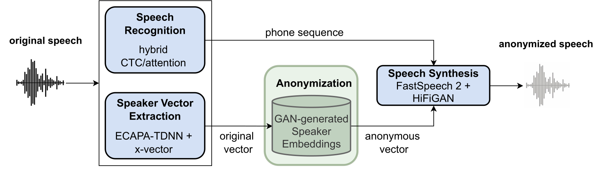

# Speaker Anonymization

**This branch contains the code to our paper ["First Steps Towards Voice Anonymization for Code-Switching Speech"](https://arxiv.org/abs/2507.01765),
that has been accepted at Interspeech 2025.**

This system is a code-switching extension of our multilingual model:


We will at this point only describe the differences of this code-switching model to the multilingual one.
For detailed information about the multilingual model, please refer to the [multilingual branch](https://github.com/DigitalPhonetics/speaker-anonymization/tree/multilingual).

## Code-Switching Extensions
* We updated the multilingual TTS and vocoder to the [latest versions supporting over 7000 languages](https://github.com/DigitalPhonetics/IMS-Toucan/releases/tag/v3.0).
* We adapted some scripts of the TTS to support setting the language embedding for each phone instead of only per utterance. We use a simple text-based language detection to recognize the language of each word in a code-switching utterance, and choose the phonemizer and language embedding for that word accordingly. Adapted scripts can be found in [anonymization/modules/tts/toucan_codeswitching](anonymization/modules/tts/toucan_codeswitching).
* We adapt code-switching specific handling during ASR and WER computation.
* Per default, prosody cloning is disabled (can be enabled in the configs) because we found that the prosody extraction would result in unreliable results in our experiments.

## Code-Switching Data
We use Seame and Bangor Miami as code-switching datasets in our experiments. You can find the scripts for data preprocessing and formatting in [data_preparation](data_preparation).


## Installation
### 1. Clone repository
Clone this repository with all its submodules:
```
git clone --recurse-submodules --branch codeswitching https://github.com/DigitalPhonetics/speaker-anonymization.git
``` 

### 2. Download models
You will need to download the following models and specify the location to them in the respective config files:

For anonymization:

| Name              | Function | Link | Location in config                                           |
|-------------------|----------|------|--------------------------------------------------------------|
| embedding_gan.pt  | Artificial speaker embeddings generator | [https://github.com/DigitalPhonetics/IMS-Toucan/releases/download/v3.0/embedding_gan.pt](https://github.com/DigitalPhonetics/IMS-Toucan/releases/download/v3.0/embedding_gan.pt) | modules > speaker_embeddings > anon_setting > gan_model_path |
| ToucanTTS_Meta.pt | TTS model | [https://github.com/DigitalPhonetics/IMS-Toucan/releases/download/v3.1/ToucanTTS_Meta.pt](https://github.com/DigitalPhonetics/IMS-Toucan/releases/download/v3.1/ToucanTTS_Meta.pt) | modules > tts > fastspeech_path                              |
| Vocoder.pt        | Vocoder | [https://github.com/DigitalPhonetics/IMS-Toucan/releases/download/v3.1.1/Vocoder.pt](https://github.com/DigitalPhonetics/IMS-Toucan/releases/download/v3.1.1/Vocoder.pt) | modules > tts > hifigan_path                                 |

For evaluation:

| Name     | Function             | Link | Location in config |
|----------|----------------------|------|--------------------|
| asv_orig | Pretrained ASV model | [https://github.com/Voice-Privacy-Challenge/Voice-Privacy-Challenge-2024/releases/download/pre_model.zip/asv_orig.zip](https://github.com/Voice-Privacy-Challenge/Voice-Privacy-Challenge-2024/releases/download/pre_model.zip/asv_orig.zip) | privacy > asv > model_dir |
You need to unzip the asv_orig.zip first which is then automatically put in a subfolder `exp`. 

The whisper and speaker embedding extraction models are downloaded automatically.

### 3. Install requirements
Create a virtual environment and install the [requirements](requirements.txt). The current code has been tested with Python 3.10.
```
pip install -r requirements.txt
```

### 4. Prepare data
As a first step, you need to prepare the MIAMI and SEAME datasets in the correct kaldi format. For this, simply run the following command:
```
python run_data_preparation.py --miami_path <path-to-MIAMI-corpus> --seame_path <path-to-SEAME-corpus> --output_path <path-to-output-files>
```
You need to specify the location of the [Bangor MIAMI](https://talkbank.org/biling/access/Bangor/Miami.html) and [SEAME](https://catalog.ldc.upenn.edu/LDC2015S04) corpora. 
If you don't already have them on your computer, you need to download these corpora first.

`<path-to-MIAMI-corpus>` should point to the root directory of the MIAMI dataset, in which folders like `audio` are located.
`<path-to-SEAME-corpus>` should point to the root directory of the SEAME dataset, in which folders like `data` are located.
`<path-to-output-files>` points to `data` as subfolder of this repository by default.

If you want to test the model on the standard voice privacy evaluation splits for English, and train the ASV model on LibriSpeech train-clean-360,
please go to the [VPC 2022 website](https://github.com/Voice-Privacy-Challenge/Voice-Privacy-Challenge-2022) to request data access. These files should also be located in your `<path-to-output-files>` in a subfolder `vpc_data`.


## Running the anonymization and evaluation pipelines
All settings in the pipeline are controlled in config files, located in the [configs](configs) folder. 
Before running any scripts, make sure that you set all paths in these configs correctly.
Anonymization and evaluation are executed in separate pipelines. You can run them with simple commands:

### Anonymization:
```
python run_anonymization.py --config anon/<anon_config> --gpu_ids <gpu_ids>
```
`<anon_config>` is the config you want to use, e.g., `anon_ims_sttts_miami_en.yaml`.
`<gpu_ids>` is a string of one or several GPU IDs you want the anonymization to use, e.g., `0` or `0,2,4`.

Note that we provided all configs to anonymize MIAMI, SEAME and the VPC data but the anonymization needs to run for each language (en, es, zh, cs) separately.

For full evaluation of the system, you will also need to anonymize libri-clean-360 (included in the VPC data) to use it as training data for the ASV evaluation model.
For this, run the anonymization with an English anonymization config (`anon_ims_sttts_miami_en.yaml`, `anon_ims_sttts_seame_en.yaml` or `anon_ims_sttts_vpc.yaml`) and the `--anonymize_train_data` argument, e.g.:
```
python run_anonymization.py --config anon/anon_ims_sttts_vpc.yaml --gpu_ids <gpu_ids> --anonymize_train_data
```
This will not run the anonymization for the evaluation data given in the config but only for the training data.

### Evaluation:
There are two types of evaluation configs. If you are confused about this, please check out the [evaluation plan of the VPC 2022](https://arxiv.org/abs/2203.12468).

#### Evaluation with models trained on original data (eval_pre)
```
python run_evaluation.py --config eval_pre/<eval_config> --gpu_ids <gpu_ids>
```
As before, `<eval_config>` is the config you want to use, e.g., `eval_pre_miami_en.yaml`.

#### ASV evaluation with a model trained on anonymized data (eval_post)
Make sure that you have anonymized the libri-clean-360 first (we need this as training data). 
The ASV model will be trained when running the evaluation pipeline with a post_eval config.
It does not matter which post evaluation you run (e.g. MIAMI-en, SEAME-zh, etc.) for training the ASV model.
Once the model is trained, the evaluation of the eval data given in the config will be started using that ASV model.
If the ASV model has been previously trained, it will not be retrained by default when running a new post evaluation (using the same or a different post_eval config).

```
python run_evaluation.py --config eval_post/<eval_config> --lang en --gpu_ids <gpu_ids>
```

### Analysis:
We also include scripts for running the same analysis that we performed in our paper. 
This includes the analysis of code-switching points and the analysis of data characteristics.
Please check the paper for more information.
To start the analysis, simply run the following command:
```
python run_analysis.py --data_path <data_path> --results_path <results_path> --dataset <dataset>
```
You only need to specify the arguments if you have different result and data locations than the defaults. The following defaults are set:
* `<data_path> =../data`
* `<results_path> =../exp`
* `<dataset> =both` which means that both miami and seame will be analyzed. You can also specify "miami" or "seame" for this argument to analyze only of the datasets

## Citations
```
@inproceedings{meyer2022speaker,
  author={Sarina Meyer and Florian Lux and Pavel Denisov and Julia Koch and Pascal Tilli and Ngoc Thang Vu},
  title={{Speaker Anonymization with Phonetic Intermediate Representations}},
  year=2022,
  booktitle={Proc. Interspeech 2022},
  pages={4925--4929},
  doi={10.21437/Interspeech.2022-10703}
}
@inproceedings{meyer2023anonymizing,
  author={Meyer, Sarina and Tilli, Pascal and Denisov, Pavel and Lux, Florian and Koch, Julia and Vu, Ngoc Thang},
  booktitle={2022 IEEE Spoken Language Technology Workshop (SLT)}, 
  title={Anonymizing Speech with Generative Adversarial Networks to Preserve Speaker Privacy}, 
  year={2023},
  pages={912-919},
  doi={10.1109/SLT54892.2023.10022601}
 }
@inproceedings{meyer2023prosody,
  author={Meyer, Sarina and Lux, Florian and Koch, Julia and Denisov, Pavel and Tilli, Pascal and Vu, Ngoc Thang},
  booktitle={ICASSP 2023 - 2023 IEEE International Conference on Acoustics, Speech and Signal Processing (ICASSP)}, 
  title={Prosody Is Not Identity: A Speaker Anonymization Approach Using Prosody Cloning}, 
  year={2023},
  pages={1-5},
  doi={10.1109/ICASSP49357.2023.10096607}
}
@inproceedings{meyer2024multilingual,
  title     = {Probing the Feasibility of Multilingual Speaker Anonymization},
  author    = {Sarina Meyer and Florian Lux and Ngoc Thang Vu},
  year      = {2024},
  booktitle = {Interspeech 2024},
  pages     = {4448--4452},
  doi       = {10.21437/Interspeech.2024-1615},
  issn      = {2958-1796},
}
```

